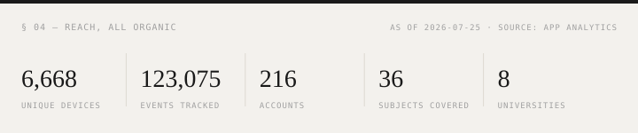
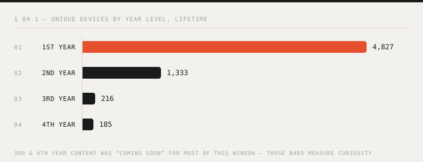
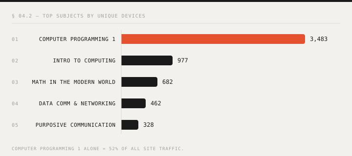

### Lawrence Panes

<samp>BSIT @ PUP · ISKOLAR NG BAYAN · BUILDER OF BSIT SURVIVAL KIT</samp>

> ### *“I built the resource I couldn’t find when I was a freshman.”*

 

---

<samp>§ 01 — WHY I BUILT THIS</samp>

## Why I built this

I entered BSIT with **zero tech background**. The summer before first year, I went looking for anything that could prepare me for the course I was about to take — and found nothing built for it. So I did what everyone does: the 10-hour YouTube coding tutorials. Weeks of them, maybe months. They gave me **false hope** — I walked into my first classes feeling prepared and understood almost nothing. Generic tutorials couldn't teach me the fundamentals, because they weren't teaching the path I was actually on.

So I stopped consuming and started building. I focused on the fundamentals in our actual curriculum and turned every lesson plan into my own project. I finished first year with a stack of self-made projects, my own learning notes, and my own assessments for every subject.

Before second year, I searched again for something to prepare with. Still nothing. But this time I remembered exactly how first-year me felt — so I opened a TikTok account and started posting my projects and subject content. **It went viral.** Incoming freshmen — people I'd never met — were offering to *pay* for the full modules, the practice exercises, the exam reviewers.

That's when this stopped being notes and became a product.

---

<samp>§ 02 — THE PROBLEM</samp>

## The problem

<samp>01</samp> &nbsp; **Nothing is built for the BSIT curriculum.** Generic tutorials and 10-hour crash courses don't map to what Philippine IT students are actually graded on — they create false confidence instead of fundamentals. I lived this.

<samp>02</samp> &nbsp; **Studying happens in the group chat, the night before.** 89% of our visitors arrive with no referrer — links opened inside section GCs and Messenger, not search. 76% visit exactly one day, clustered around exam dates. Reviewers circulate as scattered screenshots.

<samp>03</samp> &nbsp; **Ed-tech isn't built for how PH students study and pay.** In our June 2026 waitlist survey, 8 in 10 students joined from a phone. Wallets are GCash, allowance-funded — no credit cards. Global platforms price and bill for a different student.

---

<samp>§ 03 — HOW I KNOW IT'S REAL</samp>

## How I know it's real

→ **Validation came before the code.** The TikTok posts went viral and strangers offered to pay for modules, practice exercises, and exam reviewers — that demand is why the app exists.

→ **Launch day, June 16, 2026:** ~1,300 devices in a single day. Ad spend: ₱0, then and since.

→ **6,668 unique devices and 123,075 tracked events** in the first six weeks — all organic, carried GC to GC by students themselves.

→ **Demand matches the origin story exactly.** 74% of year-attributed traffic is first-years, and Computer Programming 1 alone is 52% of everything — the same overwhelmed freshman I was.

→ **It reached schools I've never set foot in** — 8 universities across Luzon, Bicol, and Mindanao appear in registered profiles, from PUP to USTP in Cagayan de Oro.

→ **Students queue for content that doesn't exist yet.** By mid-July, 82 students had joined the waitlist for unreleased upper-year content — 3rd-years raised their hands at roughly 14× the freshman rate.

---

<samp>§ 04 — REACH SO FAR</samp>

## Reach so far

<samp>TABLE — DEVICES BY YEAR LEVEL</samp>

| Year level | Unique devices |
| --- | ---: |
| 1st Year | 4,827 |
| 2nd Year | 1,333 |
| 3rd Year | 216 |
| 4th Year | 185 |

<samp>TABLE — TOP SUBJECTS</samp>

| Subject | Unique devices |
| --- | ---: |
| Computer Programming 1 | 3,483 |
| Intro to Computing | 977 |
| Math in the Modern World | 682 |
| Data Comm & Networking | 462 |
| Purposive Communication | 328 |

**Where registered students come from:**

| | University | Type | Region |
| --- | --- | --- | --- |
| <samp>01</samp> | Polytechnic University of the Philippines (PUP) | State university | NCR — Manila |
| <samp>02</samp> | University of Science and Technology of Southern Philippines (USTP) | State university | Northern Mindanao — Cagayan de Oro |
| <samp>03</samp> | President Ramon Magsaysay State University (PRMSU) | State university | Central Luzon — Iba, Zambales |
| <samp>04</samp> | Catanduanes State University (CatSU) | State university | Bicol — Virac |
| <samp>05</samp> | Pamantasan ng Lungsod ng Valenzuela (PLV) | Local university | NCR — Valenzuela |
| <samp>06</samp> | University of Eastern Pangasinan (UEP) | Local university | Ilocos — Binalonan |
| <samp>07</samp> | Colegio de Montalban (CdM) | Local college | Calabarzon — Rodriguez, Rizal |
| <samp>08</samp> | Westmead International School (WIS) | Private school | Calabarzon — Batangas City |

Numbers as of July 25, 2026, queried from the app's own analytics. Devices ≠ people: one student on two devices double-counts; a shared phone undercounts. 3rd/4th-year traffic partly measures curiosity — that content was "coming soon" for most of this window. Charts regenerate from <code>assets/story/story-data.json</code> via <code>node scripts/gen-story-svgs.mjs</code>.

---

<samp>§ 05 — WHAT'S NEXT</samp>

## What's next

The mission hasn't moved: **help someone like me — the freshman with no tech background — prepare before entering BSIT**, then carry them through all four years.

Today, lessons are free to read and the practice layer (drills, quizzes, code labs, exam reviewers with answer keys) is a one-time unlock — ₱49 for a subject-month, ₱99 for a subject-semester, ₱299 for a whole year level, paid through GCash. No auto-renew, priced for an allowance.

**Next: BSIT Survival Kit is moving to a subscription.** Not to charge more — to promise more. A subscription is a commitment on my side: new reviewers every semester as syllabi evolve, progress tracking that follows you from CP1 to capstone, and coverage that keeps widening across all four years. One student's semester at a time, this becomes the resource that meets every incoming freshman *before* their first class does.

→ **Try it:** [survival-kit-app.vercel.app](https://survival-kit-app.vercel.app)
